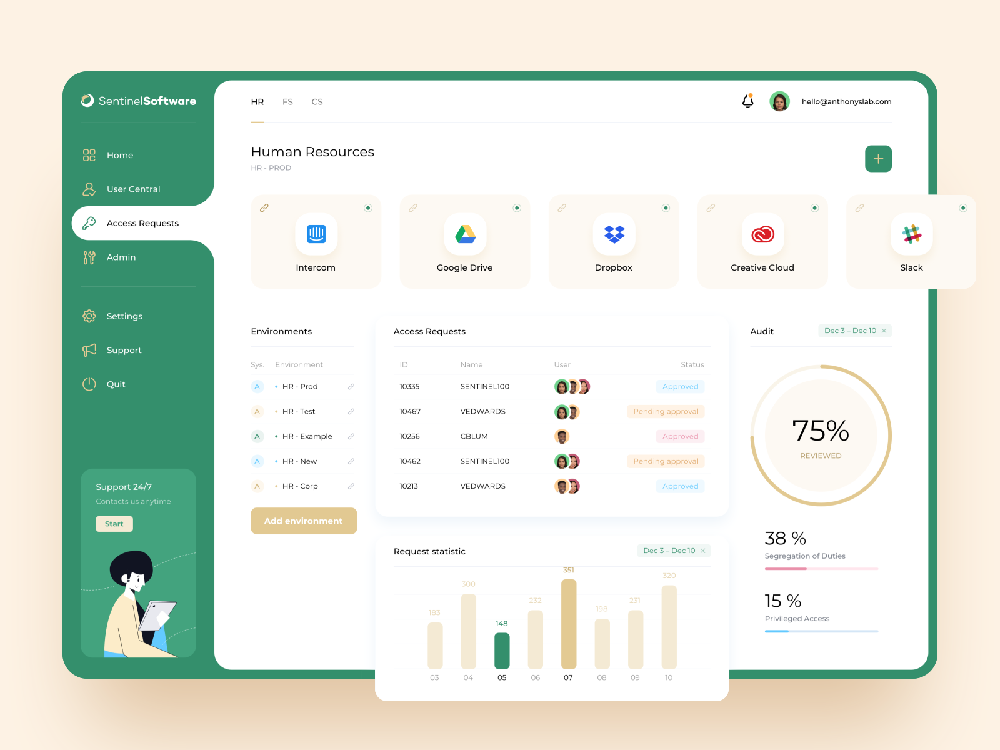

# Admin Dashboard with Dry Scss

A modern minimalist admin dashboard made with Angular with Dry SCSS approach without using any CSS framework. The design is created by [Anton Avilov](https://dribbble.com/avilov), he is an absolutely amazing designer. All the rights to the design belongs to him and I am just a curious person who wants to showcase skills using his designs. You should definitely check out his dribbble profile.

## Development server

Run `ng serve` for a dev server. Navigate to `http://localhost:4200/`. The app will automatically reload if you change any of the source files.

## Code scaffolding

Run `ng generate component component-name` to generate a new component. You can also use `ng generate directive|pipe|service|class|guard|interface|enum|module`.

## Build

Run `ng build` to build the project. The build artifacts will be stored in the `dist/` directory. Use the `--prod` flag for a production build.

